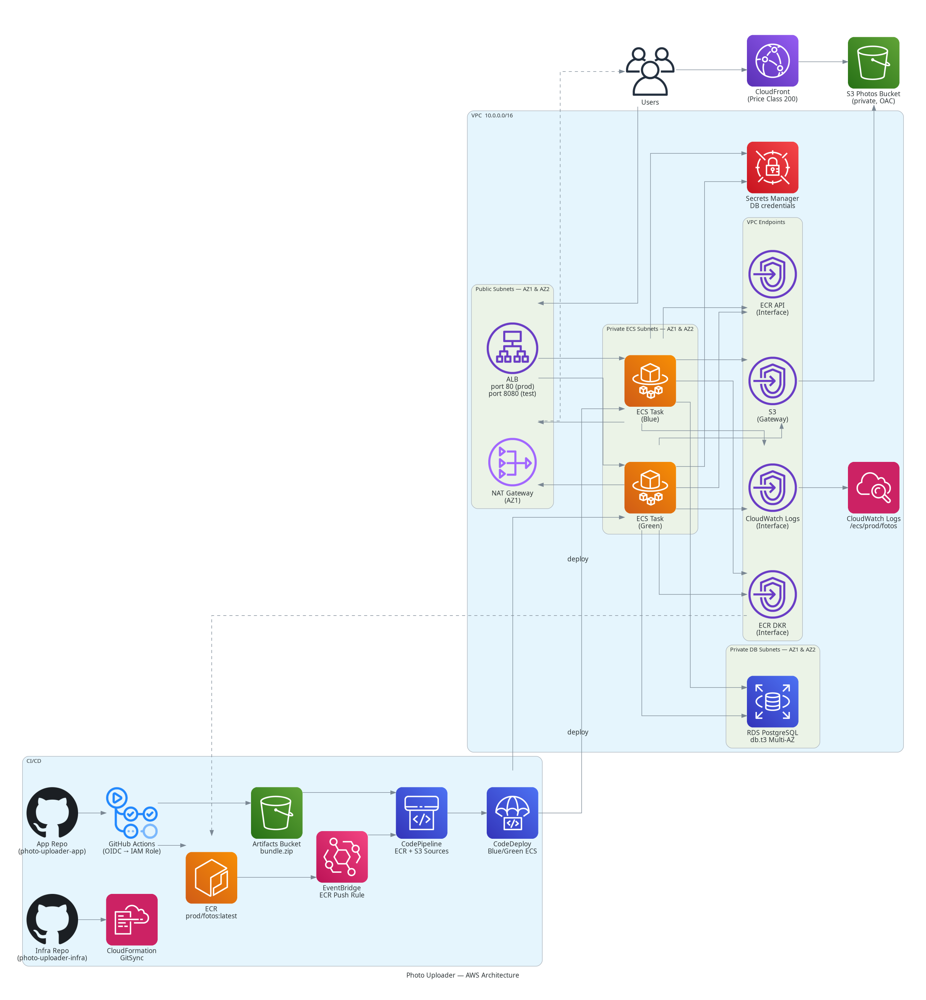

# Photo Uploader — Infrastructure

CloudFormation infrastructure for the Photo Uploader application. All resources are provisioned via **CloudFormation GitSync** — pushing a change to this repository automatically updates the live AWS stack. No manual `aws cloudformation deploy` commands are needed after initial setup.

**Application repo:** [EkowSackey/photo-uploader-app](https://github.com/EkowSackey/photo-uploader-app)

---

## Architecture



---

## Stack Overview

| Layer | AWS Services |
|---|---|
| Networking | VPC, 6 subnets across 2 AZs, IGW, NAT Gateway, VPC Endpoints |
| Compute | ECS Fargate, ALB (blue + green target groups) |
| Database | RDS PostgreSQL `db.t3` |
| Storage | S3 (photos bucket + artifacts bucket), CloudFront with OAC |
| Container registry | ECR |
| CI/CD | GitHub Actions (OIDC), CodePipeline, CodeDeploy (blue/green), EventBridge |
| IAM | OIDC provider, task execution role, task role, CodeDeploy/Pipeline/EventBridge roles |
| Observability | CloudWatch Logs, ECS Container Insights |
| Scaling | Application Auto Scaling (CPU target tracking, 1–4 tasks) |

---

## Repository Structure

```
.
├── deployment.yaml          # CloudFormation GitSync configuration
├── infra/
│   └── root.yml             # Root stack — orchestrates all nested stacks
└── templates/
    ├── vpc.yml              # VPC, subnets, IGW, NAT, route tables, VPC endpoints
    ├── security-groups.yml  # ALB, ECS, and RDS security groups
    ├── iam.yml              # All IAM roles + GitHub OIDC provider
    ├── ecr.yml              # ECR repository
    ├── s3-cloudfront.yml    # Photos S3 bucket + CloudFront distribution (OAC)
    ├── rds.yml              # RDS PostgreSQL instance + Secrets Manager credential
    ├── ecs.yml              # ECS cluster, task definition, ALB, target groups, service
    ├── autoscaling.yml      # Application Auto Scaling (CPU 70%, min 1 / max 4)
    └── pipeline.yml         # CodePipeline, CodeDeploy deployment group, EventBridge rule
```

---

## Nested Stack Dependency Order

CloudFormation resolves this automatically from `DependsOn` and `!GetAtt` references in `root.yml`:

```
VPC ──────────────────────────────────────┐
S3/CloudFront ─────────────────────────── │
ECR ──────────────────────────────────── │ │
                                         ▼ ▼
                        SecurityGroups  IAM
                               │         │
                               ▼         │
                     RDS (needs subnets + SGs)
                               │         │
                               └────┬────┘
                                    ▼
                              ECS (needs all)
                                    │
                          ┌─────────┴──────────┐
                          ▼                    ▼
                    AutoScaling            Pipeline
```


## Prerequisites

- AWS account with permissions to create all the above resources
- S3 bucket for CloudFormation nested templates (created once, manually):
  ```bash
  ACCOUNT_ID=$(aws sts get-caller-identity --query Account --output text)
  aws s3 mb s3://fotos-cfn-templates-${ACCOUNT_ID} --region eu-central-1
  aws s3api put-bucket-versioning \
    --bucket fotos-cfn-templates-${ACCOUNT_ID} \
    --versioning-configuration Status=Enabled
  ```
- Nested templates uploaded to that bucket:
  ```bash
  aws s3 sync templates/ s3://fotos-cfn-templates-${ACCOUNT_ID}/templates/
  ```

---

## Deploying via GitSync

1. In the AWS Console → **CloudFormation** → **Create stack** → **Sync from Git**
2. Connect to this GitHub repository
3. Set the deployment file path to `deployment.yaml`
4. CloudFormation creates the root stack (`prod` environment) and all nested stacks

After initial setup, all future infrastructure changes are deployed automatically on push to `main`.

### deployment.yaml Parameters

| Parameter | Value | Notes |
|---|---|---|
| `EnvironmentName` | `prod` | Prefix for all resource names and CloudFormation exports |
| `TemplatesBucket` | `fotos-cfn-templates-593793048595` | S3 bucket containing nested templates |
| `TemplatesPrefix` | `templates` | S3 key prefix |
| `AppName` | `fotos` | Application name used in resource naming |
| `GitHubOrg` | `EkowSackey` | GitHub organisation for OIDC trust policy |
| `GitHubRepo` | `photo-uploader-app` | Application repository for OIDC trust policy |
| `CreateOIDCProvider` | `false` | Set `true` if no GitHub OIDC provider exists in the account |

---

## Stack Outputs

After deployment, retrieve key values:

```bash
aws cloudformation list-exports \
  --query 'Exports[?starts_with(Name, `prod-`)].{Name:Name,Value:Value}' \
  --output table \
  --region eu-central-1
```

Key exports consumed by the application CI/CD workflow:

| Export name | Used for |
|---|---|
| `prod-ECRRepositoryUri` | Docker push target in GitHub Actions |
| `prod-EcsTaskExecutionRoleArn` | Filled into `taskdef.json` |
| `prod-EcsTaskRoleArn` | Filled into `taskdef.json` |
| `prod-DBSecretArn` | Secrets Manager reference in task definition |
| `prod-DBEndpoint` | `DB_HOST` environment variable |
| `prod-DBName` | `DB_NAME` environment variable |
| `prod-PhotosBucketName` | `S3_BUCKET_NAME` environment variable |
| `prod-CloudFrontDomainName` | `CLOUDFRONT_BASE_URL` environment variable |
| `prod-ArtifactsBucketName` | Deploy bundle upload target |
| `prod-LogGroupName` | CloudWatch log group for ECS tasks |
| `prod-GitHubActionsRoleArn` | Set as `AWS_ROLE_ARN` secret in the app repo |
